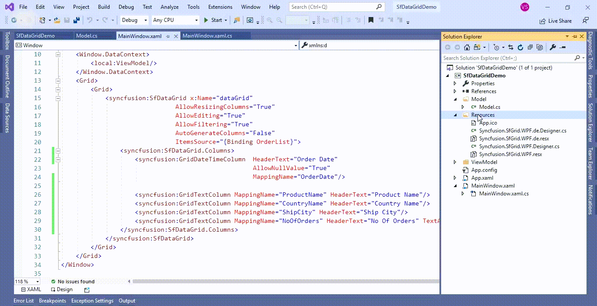
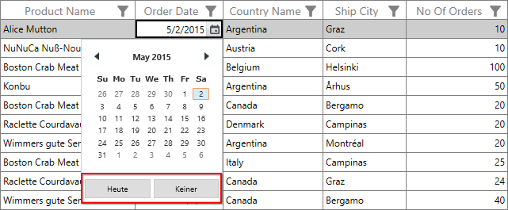

# How to localize the GridDateTimeColumn button text in WPF DataGrid (SfDataGrid)?

## About the sample
This example illustrates how to localize the GridDateTimeColumn button text in [WPF DataGrid](https://www.syncfusion.com/wpf-ui-controls/datagrid)) (SfDataGrid)

The [DateTimeEdit](https://help.syncfusion.com/cr/wpf/Syncfusion.Shared.Wpf~Syncfusion.Windows.Shared.DateTimeEdit.html) control as an edit element for [GridDateTimeColumn](https://help.syncfusion.com/cr/cref_files/wpf/Syncfusion.SfGrid.WPF~Syncfusion.UI.Xaml.Grid.GridDateTimeColumn.html) in [WPF DataGrid](https://www.syncfusion.com/wpf-ui-controls/datagrid) (SfDataGrid). The [DateTimeEdit](https://help.syncfusion.com/cr/wpf/Syncfusion.Shared.Wpf~Syncfusion.Windows.Shared.DateTimeEdit.html) control referred by **Syncfusion.Shared.Wpf** assembly. You can localize the [GridDateTimeColumn](https://help.syncfusion.com/cr/cref_files/wpf/Syncfusion.SfGrid.WPF~Syncfusion.UI.Xaml.Grid.GridDateTimeColumn.html) button text by adding the resource file as **Syncfusion.Shared.Wpf.\<culture name>.resx**.  

```C#

public MainWindow()
{
     System.Threading.Thread.CurrentThread.CurrentUICulture = new System.Globalization.CultureInfo("de");
     InitializeComponent();
}

```



The following screenshot shows the localized GridDateTimeColumn button text,



## Requirements to run the demo
Visual Studio 2015 and above versions


